<p align="center">
  
</p>

<p align="center">
  <a href="https://himanshu-nakrani.github.io/glass-transformer/"></a>
  <a href="./src/model.js"></a>
  
  
  
  
  
</p>

<br />

# The Glass Transformer

**A real GPT with glass walls.** Every number is genuinely computed — live, in your browser.

Not a diagram *about* transformers. A transformer you can open.

**[Open live demo →](https://himanshu-nakrani.github.io/glass-transformer/)** · **[Read `model.js`](./src/model.js)**

---

## Why

Most transformer explainers stop at arrows and boxes. This one **runs the math**.

A micro-GPT — **2 layers · 2 heads · d=16 · 7,568 parameters** — from scratch in pure JavaScript. Click any attention cell for the exact **q·k** products. Mute a head; watch the distribution shift. Follow the residual stream with a live **logit lens**.

Nothing is faked. The forward pass is real.

## Specs

| | |
|:--|:--|
| **Architecture** | Decoder-only GPT · causal · tied unembedding |
| **Size** | 2 blocks · 2 heads · `d=16` · `d_h=8` · `d_ff=64` |
| **Parameters** | **7,568** |
| **Vocab** | ~79 tokens · grows as you type |
| **Stack** | LayerNorm · GELU · temp / top‑k |
| **Runtime** | Browser only · single HTML file |

## What you get

| | |
|:--|:--|
| **Map** | Architecture live; residual pulses; every block is a door |
| **Tokenize → Embed** | Real IDs, 16‑d vectors, sinusoidal positions |
| **Attention** | Heatmaps + microscope: `q·k → Σ → ÷√d → bias → softmax` |
| **Heads** | Position (T5/ALiBi) · content · recency · untrained |
| **Ablation** | Mute heads → distribution updates now |
| **Stream + lens** | Vector + prediction at every depth |
| **Generate** | Sample · auto-write · flying tokens |
| **Tour** | 14-beat narrated walkthrough |

## Heads

| L | Head | Mechanism | Behavior |
|:-:|------|-----------|----------|
| 1 | **Position** | T5 / ALiBi bias | Peaks at Δ=1 |
| 1 | **Content** | Category Q/K | Same-category routing |
| 2 | **Recency** | Linear ALiBi | Prefers recent tokens |
| 2 | **Untrained** | Random | Contrast baseline |

## Honesty

The model is **untrained**. Three heads use published mechanisms (T5 / ALiBi); the rest is seeded random. A toggleable grammar prior keeps auto-write readable — switch it off to see raw untrained beliefs.

```
layernorm → QKV → causal softmax attention → residual
         → GELU MLP → residual → tied unembedding
```

Full pass every keystroke. All intermediates cached and inspectable.

## Run

```bash
npm install
npm run dev      # hot-reload
npm run build    # → dist/index.html  (one file)
```

| Key | |
|-----|--|
| `←` `→` | Stages |
| `Space` | Sample · pause tour |
| `Esc` | Exit tour |

## Source

```
src/model.js         # the micro-GPT — pure JS, zero imports
src/App.jsx          # state, generation, keyboard
src/stages.jsx       # 7 dissection stages
src/hero.jsx         # landing constellation
src/tour.jsx         # tour machine + spotlight
src/tourScript.jsx   # 14 beats
src/fx.jsx           # flying tokens
src/glossary.jsx     # hover terms
src/ui.jsx           # primitives
src/styles.css       # glass system
```

React 18 · Vite 5 · Framer Motion 11 · no other runtime deps. Pages deploy on `main`.

---

> If you can click the number, you can trust the number.

<p align="center">
  <a href="https://himanshu-nakrani.github.io/glass-transformer/">Live demo</a>
  ·
  <a href="./src/model.js">Read the model</a>
</p>
